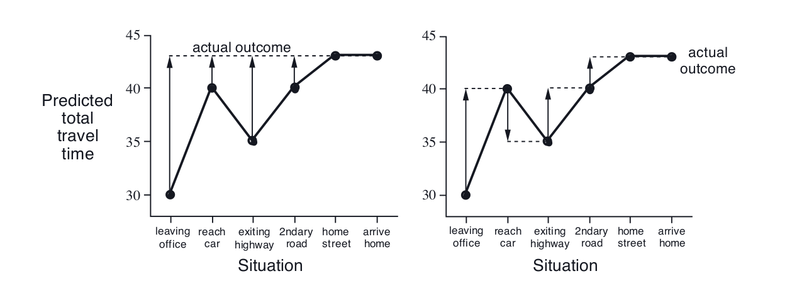

*This post assumes redears have basic knowledge about Reinforcemnet Learning, including(but not limited to) MDP, MC method, Dynamic Programming and TD learning.*

## Introduction
**TD (temporal difference) Learning** is by far the most fascinating and successful Reinforcement Learning algorithm. It bridges the gap between the traditional **trial-error** methods and some advanced ideas like **Emphasis** and **Eligibility Traces**. However, the mechanism behind the scene have often been neglected since people tend to focus on the specific implementations of this idea, like **Sarsa** and **Q-Learning**. This blog post tends to explain the TD idea more intuitively. There are also many paper and surveys about TD Learning for further readings.(**here is the references**)

## Why TD Learning?
For those who have basic knowledge of RL, **Dynamic Programming (DP)** and **Monte Carlo Learning (MC)**  should be no strangers. Dynamic Programming assumes the MDP of the environment is known and do bootstrapping to iteratively update its estimates.

Monte Carlo Learning is more like a trial-error method where the agent learns from raw experience(sample).  

TD learning is a combination
of Monte Carlo ideas and dynamic programming (DP) ideas.

Like Monte Carlo
methods, TD methods can learn directly from raw experience without a model of
the environment’s dynamics. Also like DP, TD methods update estimates based in part
on other learned estimates, without waiting for a final outcome (they bootstrap).

Obviously, TD methods have an advantage over DP methods in that they do
not require a model of the environment, of its reward and next-state probability
distributions.

The next most obvious advantage of TD methods over Monte Carlo methods is
that they are naturally implemented in an on-line, fully incremental fashion.

TD(λ) improves over the off-line λ-return algorithm in three ways. First it updates
the weight vector on every step of an episode rather than only at the end, and thus
its estimates may be better sooner. Second, its computations are equally distributed
in time rather that all at the end of the episode. And third, it can be applied to
continuing problems rather than just episodic problems.
